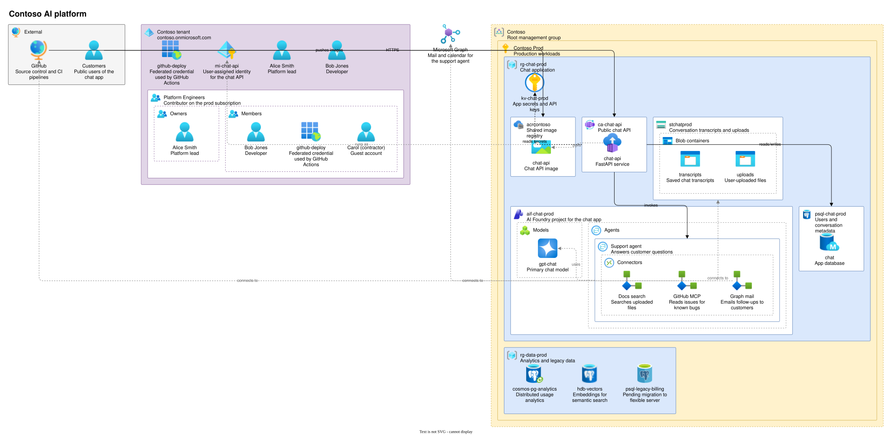

# drawio-azure-diagram-generator

[](https://github.com/zippy1981/drawio-azure-diagram-generator/actions/workflows/ci.yml)
[](https://github.com/zippy1981/drawio-azure-diagram-generator/actions/workflows/markdown-lint.yml)

Turn a YAML description of Azure infrastructure (plus Entra ID and external
systems) into a [draw.io](https://www.drawio.com/) diagram.



## Usage

```sh
pip install -e .
azdiagram examples/sample.yaml                  # writes examples/sample.drawio
azdiagram infra.yaml -o infra.drawio --no-descriptions --direction vertical
azdiagram infra.yaml --validate-only
```

The YAML format is defined by [`schema/azure-diagram.schema.json`](schema/azure-diagram.schema.json);
see [`examples/sample.yaml`](examples/sample.yaml) and [PLAN.md](PLAN.md) for the details.
The reasoning behind the design is recorded in [`docs/adr/`](docs/adr/README.md).

## Rendering to SVG

`tools/render-svg.cjs` renders a `.drawio` file with draw.io's own renderer in
headless Chromium (needs Node and the `playwright` package). draw.io's viewer
script and the icons are fetched from the `jgraph/drawio` GitHub repo and cached
in `.cache/`; icons are inlined so the SVG is self-contained.

```sh
node tools/render-svg.cjs examples/sample.drawio examples/sample.svg
```

## Tests

```sh
pip install -e '.[test,lint]'
pytest
ruff check . && ruff format --check .
mypy
```

### Linting and type checking

Configured in `pyproject.toml`:

- **ruff** checks PEP 8 style, import order and naming (`E`, `W`, `I`, `N`),
  PEP 257 docstrings (`D`, pep257 convention), and PEP 484 type hints on every
  function (`ANN`). It also requires modern annotation syntax: PEP 585 built-in
  generics and PEP 604 `X | None`, plus `from __future__ import annotations` for
  Python 3.10 (`UP`, `FA`). It also runs pyflakes, bugbear, simplify,
  comprehension, pytest-style and type-only-import rules. Tests are exempt
  from docstring rules only.
- **mypy** runs in `--strict` mode over `src/` and `tests/`, targeting Python 3.10.
- The package ships a `py.typed` marker (PEP 561), so projects that import
  `azdiagram` get its type hints.

## CI/CD

- **CI** (`.github/workflows/ci.yml`) runs on pushes to `main`, pull requests and
  manual dispatch:
  - lint with ruff and type-check with mypy `--strict`;
  - tests on Python 3.10–3.13 (Ubuntu), plus 3.13 on Windows and macOS;
  - builds the sdist and wheel, checks them with twine, and smoke-tests the
    installed wheel outside the source tree;
  - renders the sample to SVG with draw.io's renderer and uploads it as an artifact.
- **Release** (`.github/workflows/release.yml`) runs when a `v*` tag is pushed.
  The tag must match `version` in `pyproject.toml`. It reruns CI, then creates a
  GitHub release with the wheel, the sdist and the rendered sample. Tags with a
  `-` (e.g. `v0.2.0-rc1`) are marked as pre-releases.

  ```sh
  git tag v0.1.0 && git push origin v0.1.0
  ```
  
- **PyPI publishing** is off by default. To turn it on, add a
  [trusted publisher](https://docs.pypi.org/trusted-publishers/) on PyPI for this
  repo (workflow `release.yml`, environment `pypi`), create a `pypi` environment in
  the repo settings, and set the repository variable `PUBLISH_TO_PYPI` to `true`.
